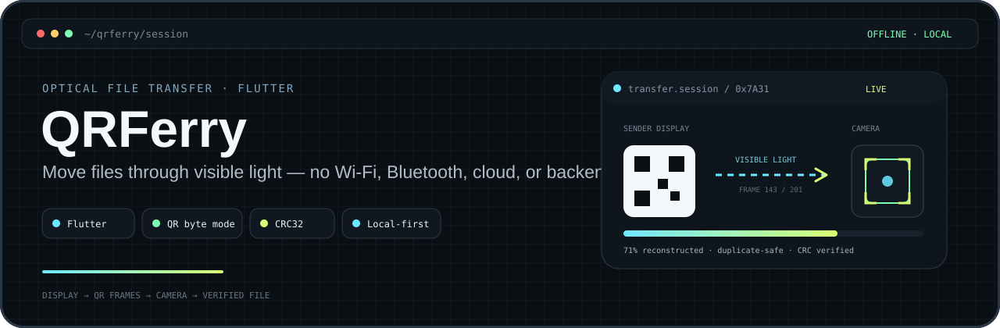
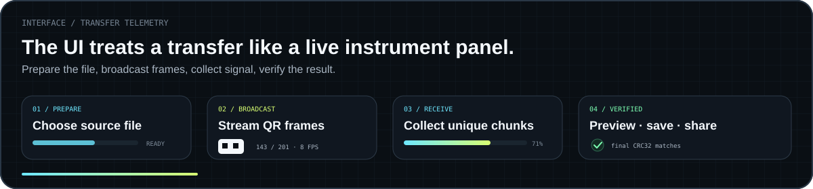
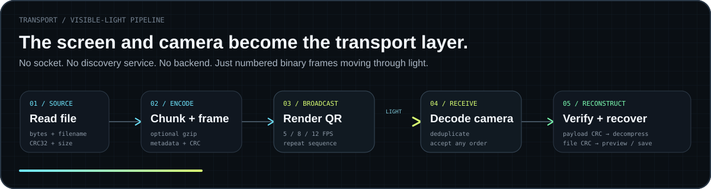
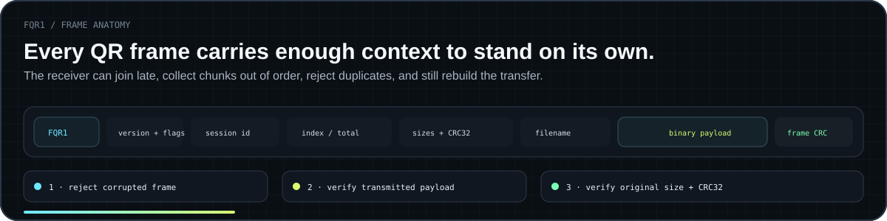

<p align="center">
  
</p>

<h1 align="center">QRFerry</h1>

<p align="center">
  <strong>Offline device-to-device file transfer through animated QR codes.</strong>
</p>

<p align="center">
  A screen becomes the transmitter. A camera becomes the receiver.<br />
  No Wi-Fi, Bluetooth, cloud storage, account, backend, cable, or pairing step required.
</p>

<p align="center">
  
  
  
  
</p>

<p align="center">
  <a href="docs/index.html"><strong>Landing page</strong></a>
  ·
  <a href="docs/privacy.html"><strong>Privacy</strong></a>
  ·
  <a href="https://github.com/itskdey/qr_ferry_flutter/issues"><strong>Issues</strong></a>
  ·
  <a href="LICENSE"><strong>License</strong></a>
</p>

<p align="center">
  
</p>

---

## Overview

QRFerry explores a deliberately simple transport model: **visible light**.

The sender reads a local file, optionally compresses it, splits it into numbered binary chunks, and displays those chunks as a repeating QR stream. The receiver watches the stream through its camera, accepts valid frames in any order, reconstructs the transmitted bytes, verifies integrity, and saves the recovered file locally.

> [!NOTE]
> QRFerry is an experimental MVP for learning, demos, air-gapped workflows, and relatively small files. It is not intended to replace a high-speed network transfer protocol.

### What makes it different

| | QRFerry |
| --- | --- |
| **Transport** | Visible QR frames instead of sockets or cloud uploads |
| **Discovery** | None — point the camera at the sender |
| **Backend** | None |
| **Account** | None |
| **Pairing** | None |
| **Integrity** | CRC32 at frame, transmitted-payload, and final-file levels |
| **Recovery** | Missed numbered chunks arrive on later stream loops |

---

<p align="center">
  
</p>

## App preview

<p align="center">
  
</p>

<table>
  <tr>
    <td align="center"><strong>Prepare</strong></td>
    <td align="center"><strong>Broadcast</strong></td>
    <td align="center"><strong>Receive</strong></td>
    <td align="center"><strong>Verified</strong></td>
  </tr>
  <tr>
    <td align="center"></td>
    <td align="center"></td>
    <td align="center"></td>
    <td align="center"></td>
  </tr>
</table>

The interface follows the same optical-tool identity as these README visuals: **warm paper-grid surfaces, near-black technical panels, signal-lime highlights, hard offset shadows, monospace metadata, and high-contrast editorial typography**.

---

## Why QRFerry?

Most file-transfer tools depend on something shared: a network, internet connection, discovery service, account, pairing workflow, cable, or backend.

QRFerry asks a narrower question:

> **What if the file itself could cross the gap through the camera?**

That makes the project useful for experimenting with air-gapped transfer concepts, binary QR transport, camera decoding, packet framing, integrity validation, out-of-order reconstruction, duplicate handling, and local-first Flutter architecture.

---

<p align="center">
  
</p>

## How it works

Each transfer uses a 32-bit session identifier. Metadata is repeated in every frame, so the receiver can begin scanning after a broadcast is already in progress. Frames can arrive out of order, duplicates are ignored, and missed chunks are recovered when the sender loops through the sequence again.

### Transfer characteristics

| Property | Current implementation |
| --- | --- |
| Maximum source file | **20 MB** |
| Default payload chunk | **512 bytes** |
| Internal chunk range | **128–1,200 bytes** |
| Broadcast presets | **5 / 8 / 12 FPS** |
| Compression | gzip, kept only when it saves at least 5% and 32 bytes |
| QR payload | Raw QR byte mode, not Base64 |
| Session identifier | 32-bit |
| Integrity | Frame CRC32 + transmitted CRC32 + original size/CRC32 |

### Approximate payload ceiling

Ignoring QR headers, metadata, decoding losses, and camera overhead, a 512-byte payload has these theoretical upper bounds:

| Playback | Raw payload per second |
| ---: | ---: |
| 5 FPS | 2,560 B/s |
| 8 FPS | 4,096 B/s |
| 12 FPS | 6,144 B/s |

Real speed is lower and depends on camera focus, screen brightness, viewing angle, reflections, device performance, file compressibility, and selected FPS.

---

<p align="center">
  
</p>

## Protocol v1

QRFerry uses a compact numbered-chunk protocol identified by the magic value `FQR1`.

Every frame includes enough information to identify and validate its transfer:

- protocol version and flags
- transfer session ID
- chunk index and total chunk count
- original and transmitted file sizes
- original and transmitted CRC32 values
- UTF-8 filename
- binary payload
- per-frame CRC32

Multi-byte integer values are encoded in little-endian order.

### Integrity model

1. **Frame CRC32** rejects an individually corrupted QR frame.
2. **Transmitted CRC32** validates the reconstructed transmitted bytes before decompression.
3. **Original size + CRC32** validates the final recovered file.

> [!IMPORTANT]
> CRC32 is an error-detection mechanism. It is **not encryption, authentication, or cryptographic tamper protection**.

---

## Received-file preview

After verification, QRFerry can inspect supported content before export.

| Content | Preview |
| --- | --- |
| JPG, JPEG, PNG, GIF, WebP, BMP | Inline image + fullscreen viewing |
| TXT, Markdown, JSON, CSV, XML, YAML, logs | Scrollable selectable text |
| Dart, JS/TS, HTML/CSS, Python, Java, Kotlin, Swift, C/C++, Rust, Go, SQL, shell | Monospace source preview |
| PDF, video, audio, archives | File metadata/type card |
| Other binary files | Generic filename, type, and size card |

Large text documents are intentionally bounded rather than rendered in full at once.

---

## Getting started

### Requirements

- Flutter with Dart **3.11 or later**
- Android Studio + Android SDK for Android development
- macOS + Xcode + CocoaPods for iOS development
- A physical camera device for realistic receiver testing

**Targets:** Android 7.0+ / SDK 24 · iOS 13.0+

### Clone and run

```bash
git clone https://github.com/itskdey/qr_ferry_flutter.git
cd qr_ferry_flutter
flutter pub get
flutter run
```

No API keys, cloud credentials, backend configuration, or environment secrets are required.

### Basic usage

**Send**
1. Choose **Send a file**.
2. Select a local file.
3. Start with **Balanced / 8 FPS**.
4. Begin the QR stream and keep the screen visible.

**Receive**
1. Choose **Receive a file**.
2. Grant camera permission.
3. Keep the full QR code and margin inside the camera frame.
4. Wait for 100% + final verification.
5. Preview, save, or share the recovered file.

> [!TIP]
> If decoding stalls, switch to **5 FPS**, increase screen brightness, keep both devices square to each other, and make sure the complete QR margin remains visible.

---

## Architecture

The protocol layer is separated from the UI so the transport can evolve without requiring an interface rewrite.

```text
lib/
├── main.dart
├── app.dart
├── routes/
├── core/
│   ├── protocol/
│   │   ├── crc32.dart
│   │   ├── transfer_encoder.dart
│   │   ├── transfer_frame.dart
│   │   └── transfer_receiver.dart
│   └── utils/
├── features/
│   ├── home/
│   ├── send/
│   ├── receive/
│   └── details/
└── widgets/
    ├── binary_qr_view.dart
    └── qrferry_design.dart
```

### Main dependencies

| Package | Purpose |
| --- | --- |
| `get` | Navigation, dependency injection, reactive state |
| `file_picker` | Native file selection |
| `qr` | Binary QR matrix generation |
| `mobile_scanner` | Camera scanning and raw decoded QR bytes |
| `path_provider` | Application storage paths |
| `share_plus` | Native share/save sheet |
| `google_fonts` | Typography support |

Compression, CRC32, binary serialization, isolates, reconstruction, and preview logic are implemented in Dart/Flutter and project code.

---

## Privacy & security

QRFerry does not use a file-upload backend. File content is read, encoded, displayed, decoded, reconstructed, previewed, and saved locally.

**Offline does not mean secret:**

- the QR stream is currently unencrypted
- someone able to record enough frames may be able to reconstruct the file
- CRC32 protects against accidental corruption, not malicious modification
- there is no sender identity verification or receiver authentication yet

Do not display sensitive transfers where untrusted people or cameras can observe the sender screen.

See the full [Privacy Policy](docs/privacy.html).

---

## Current limitations

- 20 MB maximum source file
- no RaptorQ or other forward-error-correction layer
- no encryption or password protection
- no sender/receiver authentication
- no persisted resumable receive session
- no background transfer mode
- no transfer history
- missed chunks may require waiting for the next sender loop
- PDF page rendering is not yet implemented
- video/audio playback previews are not yet implemented
- Android and iOS are the current targets

---

<details>
<summary><strong>Development commands</strong></summary>

### Format and analyze

```bash
dart format --output=none --set-exit-if-changed lib test
flutter analyze
```

### Tests

```bash
flutter test
```

### Builds

```bash
flutter build apk
flutter build appbundle
flutter build ios
```

> [!WARNING]
> Before publishing an Android build, configure an appropriate release keystore and signing setup.

</details>

---

## Contributing

Issues, bug reports, performance observations, protocol experiments, and focused pull requests are welcome.

For transfer problems, useful details include the sender/receiver device models, OS versions, file type and size, selected FPS, lighting/viewing conditions, approximate progress when the failure occurred, and whether lowering FPS changed the result.

**[Open an issue](https://github.com/itskdey/qr_ferry_flutter/issues)**

---

## License

QRFerry is released under the [MIT License](LICENSE).

<p align="center">
  <strong>QRFerry</strong><br />
  Device-to-device optical file transfer, built with Flutter.
</p>
