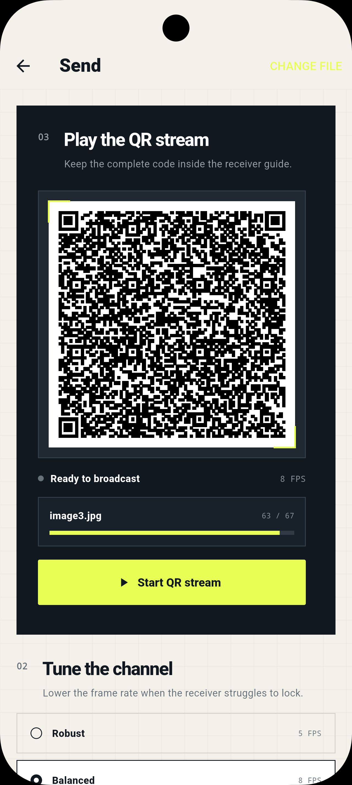
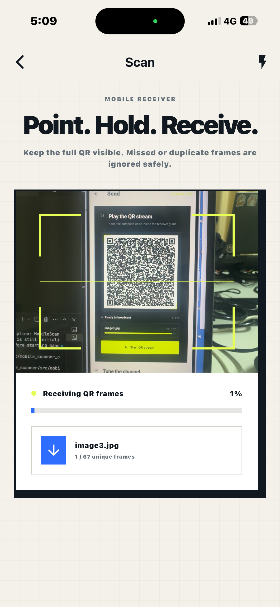

# QR Ferry

**Offline device-to-device file transfer through animated QR codes, built with Flutter.**

QR Ferry turns a file into a repeating stream of binary QR frames on one device and reconstructs it with the camera on another. The entire transfer happens locally: no Wi-Fi, mobile data, Bluetooth, cloud storage, account, backend, or pairing step is required.

The sender's **display** and the receiver's **camera** are the transport channel.

> [!NOTE]
> QR Ferry is currently an MVP focused on a small, readable, pure-Dart transfer protocol. It is designed for experiments, learning, demos, and relatively small files. It is not yet a replacement for a high-speed network transfer protocol.

## Preview

<p align="center">
  
  &nbsp;&nbsp;
  
</p>

| Sender | Receiver |
| --- | --- |
| Select a file, choose the playback speed, and broadcast its binary chunks as a repeating QR stream. | Point the camera at the sender, collect unique frames in any order, verify the transfer, preview the recovered file, then save or share it. |

The current interface follows an optical-tool / editorial visual language: warm paper grid backgrounds, near-black panels, neon signal-lime highlights, hard offset shadows, technical monospace labels, and large high-contrast typography.

## Why QR Ferry?

Most file-transfer apps depend on a network, pairing, discovery, a server, or a shared account. QR Ferry explores a different transport model: **visible light**.

A sender does not open a socket or upload a file. It renders bytes as QR codes. A receiver does not connect to the sender. It observes those QR codes through the camera and rebuilds the original file locally.

That makes the project useful for experimenting with:

- air-gapped or network-restricted transfer concepts
- QR byte-mode capacity and rendering
- continuous camera decoding
- binary packet design
- out-of-order chunk collection
- integrity checking
- local-first Flutter architecture
- optical-channel UX and performance

## Features

### Sender

- Pick any locally accessible file with the system file picker
- Maximum input size of **20 MB** in the current MVP
- Calculate an original-file CRC32 before transmission
- Try gzip compression off the UI isolate
- Keep the compressed result only when it saves at least **5% and 32 bytes**
- Split transmitted bytes into **512-byte payload chunks** by default
- Serialize compact binary frames with metadata and per-frame CRC32
- Encode frame bytes directly using QR **byte mode** instead of Base64
- Broadcast the frames in a repeating animation
- Select **5 FPS**, **8 FPS**, or **12 FPS**
- Show current frame number, total frame count, loop count, compression status, and file size

### Receiver

- Continuously scan QR codes with the rear camera
- Use raw decoded QR bytes rather than converting the payload to text
- Accept frames in any order
- Ignore duplicate frames safely
- Lock onto one transfer session at a time
- Reject invalid/corrupted transfer frames
- Display live unique-frame progress
- Reassemble all chunks by index
- Verify the transmitted payload before decompression
- Automatically decompress gzip transfers
- Verify the final file size and original CRC32
- Save recovered files under `QR_Ferry_Received`
- Avoid overwriting existing files by adding names such as `file (1).ext`
- Export through the native share/save sheet

### Received-file preview

A completed transfer can be inspected before exporting it.

| File type | Current preview behavior |
| --- | --- |
| JPG, JPEG, PNG, GIF, WebP, BMP | Inline image preview; tap to open a fullscreen zoomable viewer |
| TXT, Markdown, JSON, CSV, XML, YAML, logs | Scrollable selectable text preview |
| Dart, JS/TS, HTML/CSS, Python, Java, Kotlin, Swift, C/C++, Rust, Go, SQL, shell files | Monospace source preview |
| PDF | File metadata/type card |
| Video | File metadata/type card |
| Audio | File metadata/type card |
| ZIP/RAR/7z/TAR/GZ | Archive metadata/type card |
| Other binary files | Generic filename, type, and size card |

Text previews are intentionally bounded so a large received document does not try to render the entire file at once.

## Transfer flow

```text
┌──────────────────── SENDER ────────────────────┐
│                                                │
│  Select local file                             │
│       │                                        │
│       ▼                                        │
│  Read original bytes                          │
│       │                                        │
│       ├──► Original CRC32                      │
│       │                                        │
│       ▼                                        │
│  Try gzip compression                          │
│       │                                        │
│       ▼                                        │
│  Split into numbered chunks                    │
│       │                                        │
│       ▼                                        │
│  Add metadata + frame CRC32                    │
│       │                                        │
│       ▼                                        │
│  Render raw binary QR frame                    │
│       │                                        │
│       └──── repeat at 5 / 8 / 12 FPS ─────┐   │
└─────────────────────────────────────────────│───┘
                                              │ light
                                              ▼
┌─────────────────── RECEIVER ───────────────────┐
│                                                │
│  Camera decodes QR bytes                       │
│       │                                        │
│       ▼                                        │
│  Parse + validate frame CRC32                  │
│       │                                        │
│       ▼                                        │
│  Deduplicate and store by chunk index          │
│       │                                        │
│       ▼                                        │
│  Wait until every chunk has arrived            │
│       │                                        │
│       ▼                                        │
│  Verify transmitted CRC32                      │
│       │                                        │
│       ▼                                        │
│  Decompress when required                      │
│       │                                        │
│       ▼                                        │
│  Verify original size + CRC32                  │
│       │                                        │
│       ▼                                        │
│  Save → Preview → Share                        │
└────────────────────────────────────────────────┘
```

Each transfer receives a 32-bit session identifier. Metadata is repeated in every frame, so the receiver can begin watching after playback has already started. The receiver stores only unique chunks; if a frame is missed, the sender eventually displays it again on the next loop.

## UI walkthrough

### 1. Send a file

The sender starts with an **air-gapped file transfer** view. After choosing a file, QR Ferry prepares the payload and moves into the broadcast screen.

<p align="center">
  
</p>

The dark QR stage is the optical output. Below it you can see whether broadcasting is active, the selected FPS, the current frame position, and stream progress.

Playback presets are intentionally simple:

| Mode | Rate | Recommended use |
| --- | ---: | --- |
| Robust | 5 FPS | Older cameras, difficult lighting, larger distance |
| Balanced | 8 FPS | Recommended starting point |
| Turbo | 12 FPS | Good focus, bright screen, capable receiver |

If reception stalls, reducing FPS usually gives the camera more time to obtain a clean exposure and decode each symbol.

### 2. Receive a file

The receiver uses the rear camera and places a lime optical guide over the preview.

<p align="center">
  
</p>

As soon as a valid `FQR1` frame is detected, the screen begins showing the incoming filename and the number of unique frames collected. Duplicate frames are harmless and do not advance progress.

At 100%, scanning stops while QR Ferry validates and writes the reconstructed file. A successful transfer changes to the verified state and shows the received-file preview.

## Getting started

### Requirements

- Flutter / Dart **3.11 or later**
- Android Studio + Android SDK for Android development
- macOS + Xcode + CocoaPods for iOS development
- A physical camera device for real receiver testing

The included native targets currently support:

- **Android:** minimum SDK 24 / Android 7.0+
- **iOS:** 13.0+

### Clone and run

```bash
git clone https://github.com/itskdey/qr_ferry_flutter.git
cd qr_ferry_flutter
flutter pub get
flutter run
```

To check available devices:

```bash
flutter doctor
flutter devices
```

Run on a specific target:

```bash
flutter run -d <device-id>
```

No API keys, environment variables, cloud credentials, or backend configuration are required.

## How to use

### Sending

1. Launch QR Ferry on device A.
2. Choose **Send a file**.
3. Tap **Browse files**.
4. Select the file you want to transfer.
5. Start with **Balanced / 8 FPS**.
6. Tap **Start QR stream**.
7. Keep the sender display awake and visible until the receiver reaches 100%.

### Receiving

1. Launch QR Ferry on device B.
2. Choose **Receive a file**.
3. Grant camera permission if requested.
4. Point the rear camera at the complete QR code on device A.
5. Keep the full white QR square inside the lime guide.
6. Hold the devices steady while the unique-frame count increases.
7. When verification completes, inspect the preview.
8. Tap **Share / Save file** to export it, or **Scan another transfer** to reset the receiver.

## Protocol v1

QR Ferry currently uses a simple numbered-chunk protocol rather than fountain coding. Multi-byte integers are unsigned and encoded in little-endian order.

| Offset | Size | Field | Description |
| ---: | ---: | --- | --- |
| 0 | 4 | Magic | ASCII `FQR1` |
| 4 | 1 | Version | Protocol version, currently `1` |
| 5 | 1 | Flags | Bit 0 = gzip compressed |
| 6 | 4 | Session | 32-bit transfer identifier |
| 10 | 4 | Chunk index | Zero-based position of this payload |
| 14 | 4 | Chunk count | Number of chunks in the transfer |
| 18 | 4 | Original size | File size before optional compression |
| 22 | 4 | Transmitted size | Actual number of bytes carried by the stream |
| 26 | 4 | Original CRC32 | CRC32 of the original file |
| 30 | 4 | Transmitted CRC32 | CRC32 before optional decompression |
| 34 | 1 | Filename length | UTF-8 filename length, max 80 bytes |
| 35 | 2 | Payload length | Number of payload bytes in this frame |
| 37 | N | Filename | UTF-8 filename |
| 37 + N | M | Payload | Binary chunk bytes |
| 37 + N + M | 4 | Frame CRC32 | CRC32 of all preceding frame bytes |

Default payload size is **512 bytes**. The encoder supports custom chunk sizes from **128 to 1,200 bytes** internally.

### Integrity model

There are three separate integrity checks:

1. **Frame CRC32** — rejects an individually corrupted QR frame.
2. **Transmitted CRC32** — validates the fully joined stream before decompression.
3. **Original size + CRC32** — validates the final reconstructed file.

CRC32 is an error-detection mechanism, **not** authentication or cryptographic tamper protection.

## Performance

Ignoring frame headers and camera losses, a 512-byte payload gives these theoretical payload rates:

| Playback | Payload per second |
| ---: | ---: |
| 5 FPS | 2,560 B/s |
| 8 FPS | 4,096 B/s |
| 12 FPS | 6,144 B/s |

Real throughput is lower because QR frames contain metadata and cameras do not necessarily decode every displayed frame.

Performance depends heavily on:

- screen brightness
- QR size on the sender display
- camera focus
- viewing angle
- reflections and motion blur
- device camera frame rate
- QR decode performance
- selected playback FPS
- file compressibility

Because the current protocol uses numbered chunks, a missed chunk is recovered when the sender loops back to it. This is simple and reliable for an MVP but less efficient than RaptorQ/fountain coding under heavy frame loss.

## Project structure

```text
assets/
└── screenshot/
    ├── sender_qr.png                  # Sender UI screenshot used by this README
    └── recieve_scanner.PNG            # Receiver UI screenshot used by this README

lib/
├── main.dart                          # Flutter bootstrap + portrait orientation
├── app.dart                           # GetMaterialApp and QRFerry theme
├── routes/
│   ├── app_routes.dart                # /, /send, /receive
│   └── app_pages.dart                 # GetX routes and bindings
├── core/
│   ├── protocol/
│   │   ├── crc32.dart                 # CRC32 implementation
│   │   ├── transfer_encoder.dart      # File read, gzip, chunk preparation
│   │   ├── transfer_frame.dart        # FQR1 serialization and parsing
│   │   └── transfer_receiver.dart     # Deduplication and reconstruction
│   └── utils/
│       └── formatters.dart            # Byte / percentage formatting
├── features/
│   ├── home/
│   │   └── home_screen.dart           # Device-to-device landing screen
│   ├── send/
│   │   ├── send_binding.dart
│   │   ├── send_controller.dart       # Playback timer and file preparation
│   │   └── send_screen.dart           # Broadcast UI
│   └── receive/
│       ├── receive_binding.dart
│       ├── receive_controller.dart    # Camera, collection, saving, sharing
│       └── receive_screen.dart        # Scanner + received-file preview
└── widgets/
    ├── binary_qr_view.dart            # Pixel-aligned raw binary QR renderer
    ├── ferry_card.dart                # Legacy/shared card helper
    └── qrferry_design.dart            # Paper grid, palette and design primitives

test/
├── protocol_test.dart                 # CRC/frame/reconstruction tests
└── getx_navigation_test.dart          # GetX route lifecycle test
```

The protocol layer is intentionally separated from the interface. A future RaptorQ or Rust implementation can replace the chunk codec without requiring a complete UI rewrite.

## Main dependencies

| Package | Role |
| --- | --- |
| `get` | Reactive state, dependency injection, navigation |
| `file_picker` | Native file selection |
| `qr` | Binary QR matrix generation |
| `mobile_scanner` | Camera QR decoding and raw decoded bytes |
| `path_provider` | Application documents location |
| `share_plus` | Native share/save sheet |

Compression, binary serialization, CRC32, isolates, file reads, and received-file previews are implemented with Dart/Flutter APIs and project code.

## Development

Format and analyze:

```bash
dart format --output=none --set-exit-if-changed lib test
flutter analyze
```

Run tests:

```bash
flutter test
```

Build artifacts:

```bash
flutter build apk
flutter build appbundle
flutter build ios
```

> [!WARNING]
> The Android release configuration in this MVP currently points at the debug signing configuration. Set up your own release keystore before publishing an APK/AAB.

## Privacy and security

QR Ferry has no file-upload transport. File content is read, encoded, decoded, reconstructed, previewed, and saved locally.

However, **offline does not mean secret**:

- The visible QR stream is currently unencrypted.
- Someone able to record enough of the QR stream may be able to reconstruct the file.
- CRC32 protects against accidental corruption, not malicious modification or forgery.
- There is no sender identity verification or receiver authentication.
- The receiver accepts the first valid transfer session and ignores another session until reset.

Do not use the current MVP to display sensitive information where untrusted observers can see or record the sender screen.

## Current limitations

- 20 MB maximum source file
- No RaptorQ or other forward-error correction
- No encryption or password protection
- No sender/receiver authentication
- No resumable persisted receive session
- No transfer history
- No background transfer mode
- A missed numbered chunk may require waiting for the next full sender loop
- Real PDF page rendering is not implemented yet
- Video/audio playback previews are not implemented yet
- Android and iOS runners only

## Troubleshooting

### Receiver does not detect the stream

- Start with **5 FPS**.
- Increase sender screen brightness.
- Keep the complete QR and its white margin visible.
- Move closer without cropping the code.
- Keep both devices square to each other.
- Clean the receiver camera lens.
- Avoid reflections and direct glare.
- Verify camera permission in system settings.

### Progress gets stuck below 100%

Keep the sender playing. The stream repeats continuously and missing frames can arrive on a later loop. If the unique count stops increasing for a long time, lower FPS or adjust distance/focus.

### A new sender is ignored

The receiver intentionally locks onto one session. Finish the current transfer or use **Scan another transfer** before receiving a different one.

### iOS CocoaPods issues

```bash
flutter pub get
cd ios
pod install
cd ..
```

When opening the iOS project manually, use `ios/Runner.xcworkspace` after pods have been installed.

## Roadmap

Possible next stages:

- RaptorQ / fountain-code reception for loss tolerance
- Rust codec through `dart:ffi`
- Higher-density and higher-FPS QR profiles
- Adaptive sender FPS based on receiver conditions
- Full PDF page preview
- Native video and audio preview
- Authenticated encryption
- Transfer pause/resume and persisted sessions
- Optical-channel benchmarks across real devices
- Expanded integration, fuzz, corrupted-frame, and camera tests

## Inspiration

QR Ferry is a Flutter exploration inspired by the optical file-transfer ideas in [deedy/qr-data-transfer](https://github.com/deedy/qr-data-transfer). This repository currently uses its own intentionally simpler numbered-chunk protocol rather than QRFerry's RaptorQ/WASM implementation.

## License

Released under the [MIT License](LICENSE).
